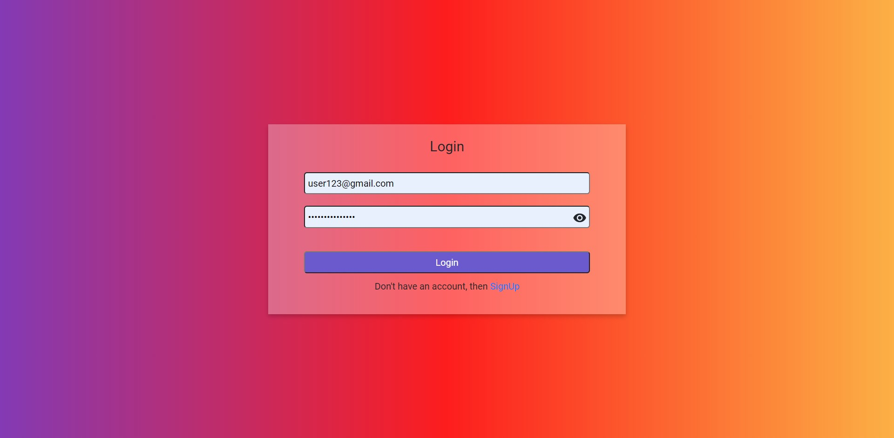

# Hotel Reservation System

Hotel Reservation System is a full-stack web application using which a user could
book a room in a hotel, cancel or partially cancel his room booking,
view/ update his profile on the website etc.

## Technologies Used: React, Node.js, Express, MongoDB.

## link: https://hotel-reservation-system.netlify.app/

## Screenshots

### Login Page

